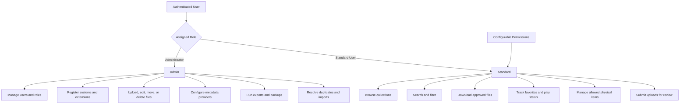
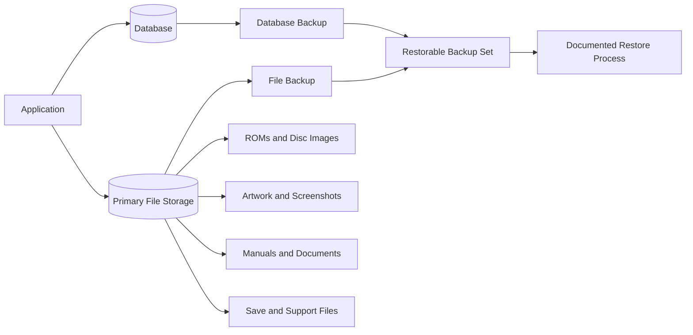
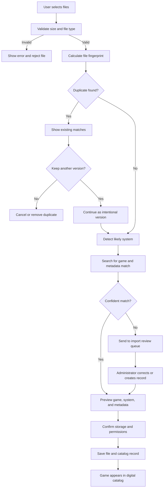
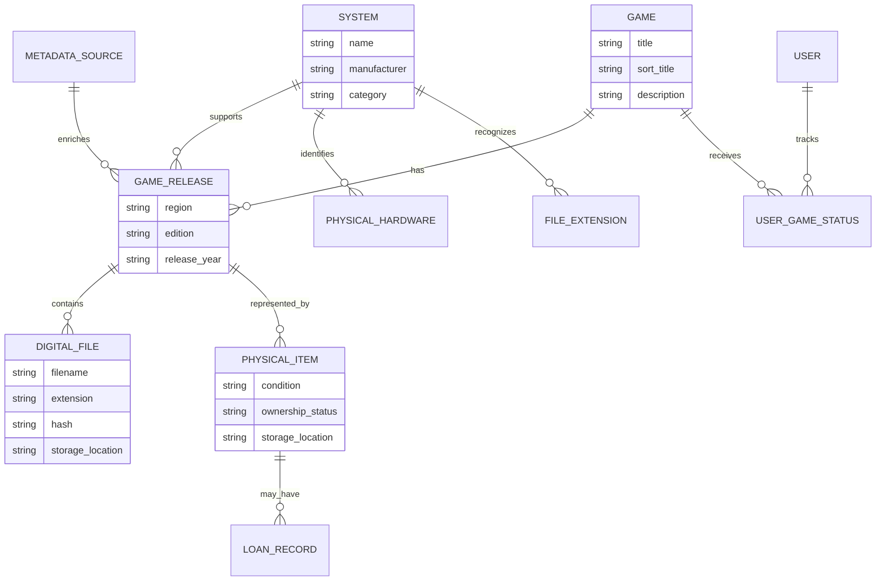
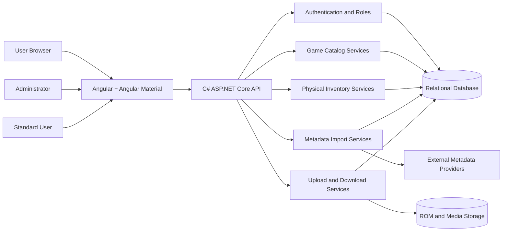

# Game Library & ROM Collection Manager

## Product Design Overview

**Document status:** Initial project overview  
**Project type:** Private, self-hosted collection management application  
**Primary platforms:** Web browser, desktop-oriented responsive interface  
**Frontend:** Angular with Angular Material  
**Backend:** C# with ASP.NET Core  

---

## 1. Product Summary

The Game Library & ROM Collection Manager is a private web application for organizing digital game files, registered game systems, and a physical video game collection in one place.

The application will allow users to:

- Maintain a searchable catalog of digital game files.
- Track physical games, consoles, accessories, and related media.
- Register official and custom game systems.
- Associate file extensions with supported systems.
- Import game and system metadata from external providers.
- Upload, organize, and download ROMs and related files.
- Separate administrator capabilities from standard user access.
- Track collection details such as condition, ownership, location, and completeness.

The product is intended for private collection management, preservation of legally owned media, homebrew software, and other files the owner is authorized to store. It will not include features for discovering or downloading copyrighted games from unauthorized sources.

---

## 2. Product Vision

Create a single, clean, private library that answers three questions:

1. **What games and systems do I own?**
2. **Where are the physical items and digital files located?**
3. **What information, artwork, manuals, and related files belong to each item?**

The application should feel like a personal game museum, digital archive, and inventory system rather than a basic file browser.

---

## 3. Primary Goals

- Make large digital and physical game collections easy to search and browse.
- Reduce duplicate files and duplicate physical purchases.
- Keep game files organized by system and title.
- Provide a consistent metadata structure across many consoles and file formats.
- Allow custom or uncommon systems to be registered without code changes.
- Make collection data portable through exports and backups.
- Protect private files through authentication and role-based access.
- Keep the interface simple enough for normal users while giving administrators full control.

---

## 4. User Types

### 4.1 Administrator

Administrators manage the application, users, systems, metadata settings, storage, and the complete collection.

Administrators can:

- Create, edit, disable, and manage users.
- Assign administrator or standard-user roles.
- Register and configure game systems.
- Define file extensions associated with each system.
- Upload, replace, move, and delete digital files.
- Edit all game and collection metadata.
- Configure metadata import providers.
- Resolve duplicate or unmatched records.
- View activity and administrative logs.
- Run exports and backups.
- Manage application-wide settings.

### 4.2 Standard User

Standard users can browse and use the collection without changing sensitive application settings.

Depending on permissions, standard users can:

- Browse digital and physical collections.
- Search, filter, and view item details.
- Download approved digital files.
- Add personal notes, favorites, ratings, or play status.
- Create wish-list entries.
- Check physical items in or out.
- Suggest metadata corrections.
- Upload files into a review queue, when permitted.

Permissions should be configurable so a standard user can be read-only or receive selected collection-management capabilities.

### Role and Permission Overview

Standard-user capabilities should be configurable so deployments can choose between read-only users and trusted contributors.

---

## 5. Core Product Areas

## 5.1 Authentication and Account Access

The application will begin with a dedicated login screen.

Core account features:

- Username or email login.
- Secure password authentication.
- Administrator and standard-user roles.
- Logout from the current session.
- Password change and password reset workflow.
- Disabled or locked user accounts.
- Optional persistent login on trusted devices.
- User profile with display name and preferences.
- Optional future support for multi-factor authentication or single sign-on.

The first account created during application setup should become the initial administrator.

---

## 5.2 Dashboard

The dashboard provides a high-level view of the entire collection.

Suggested dashboard information:

- Total digital games.
- Total physical games.
- Total registered systems.
- Total consoles and accessories.
- Recently added items.
- Recently played or downloaded games.
- Items missing metadata or artwork.
- Duplicate files or possible duplicate records.
- Physical items currently loaned out.
- Storage usage by system.
- Collection value, when purchase or estimated values are recorded.
- Quick actions for adding games, systems, physical items, or files.

The dashboard should be useful without becoming overly complicated.

---

## 5.3 Game System Registry

The system registry defines every platform supported by the application.

A system record may represent:

- Home consoles.
- Handheld systems.
- Computers.
- Arcade platforms.
- Custom emulation platforms.
- Homebrew platforms.
- Collections or virtual systems created by the administrator.

Each system can contain:

- System name.
- Short name or abbreviation.
- Manufacturer.
- Original release period.
- Generation or category.
- Region information.
- Description.
- System logo and artwork.
- Supported file extensions.
- Preferred folder or storage location.
- Metadata-provider identifiers.
- Default emulator or launch information for future use.
- Active, hidden, or archived status.

Administrators can create custom systems without requiring a software update.

### File Extension Mapping

A system can be associated with one or more file extensions, such as:

- `.nes`
- `.sfc`
- `.gba`
- `.iso`
- `.cue`
- `.chd`
- `.zip`

The mapping helps the application identify a likely system when a file is uploaded or imported.

The administrator should be able to:

- Add and remove extensions.
- Mark one extension as preferred.
- Share an extension across multiple systems when necessary.
- Define rules for multi-file formats.
- Resolve files that cannot be identified automatically.

File extensions should assist identification but should not be treated as the only source of truth.

---

## 5.4 Digital Game Catalog

The digital catalog stores information about ROMs, disc images, homebrew games, patches, manuals, artwork, and related files.

Each digital game entry may include:

- Game title.
- Sort title.
- Alternate titles.
- Associated system.
- Region.
- Language.
- Release date or year.
- Publisher and developer.
- Genre.
- Player count.
- Description.
- Cover artwork and screenshots.
- Content rating.
- Personal rating.
- Favorite status.
- Play status.
- Completion status.
- Personal notes.
- Tags.
- Date added.
- Metadata source.
- File availability and storage location.

### Digital File Information

One game may have one or more files, including:

- Main ROM or disc image.
- Multi-disc files.
- BIOS or support files, when appropriate and legally stored.
- Patches.
- Translations.
- Manuals.
- Box artwork.
- Screenshots.
- Save files.
- Configuration files.
- Cheat or reference files.
- Other supporting documents.

For each file, the application should track:

- Original filename.
- Display name.
- File type.
- File extension.
- File size.
- Upload date.
- Storage location.
- File hash or fingerprint.
- Version, revision, or disc number.
- Region and language when file-specific.
- Whether the file is available for download.
- Whether the file is the preferred version.
- Notes.

A game record should not require a ROM file. This allows cataloging games that are known, planned, missing, or represented only by physical media.

---

## 5.5 File Upload and Import

Administrators and approved users can upload digital game files and related content.

Expected upload capabilities:

- Single-file upload.
- Multiple-file upload.
- Drag-and-drop upload.
- Visible upload progress.
- Large-file support.
- File validation.
- Automatic file-extension detection.
- Suggested system based on extension.
- Duplicate detection using file hashes.
- Metadata match suggestions.
- Upload review before final catalog placement.
- Ability to cancel failed or incorrect uploads.
- Clear reporting of unsupported files.

### Import Review Queue

New files should pass through a review step when the application is uncertain about their identity.

The review queue may show:

- Detected filename.
- Suggested system.
- Suggested game match.
- Possible duplicate files.
- Missing required information.
- Metadata confidence.
- Recommended action.

The administrator can approve, correct, merge, skip, or reject each item.

### Future Folder Scanning

A future version may support scanning an existing server folder and importing discovered files without manually uploading each one.

---

## 5.6 File Download and Data Access

Authorized users can download digital files from the game detail page.

Download features may include:

- Download the primary game file.
- Select from multiple versions or regions.
- Download related files individually.
- Download a packaged group of related files.
- Display file size before download.
- Restrict selected files to administrators.
- Record basic download activity.
- Prevent access to files a user is not permitted to retrieve.
- Support partial or resumed downloads in a future version.

The application should stream files securely rather than exposing direct storage paths.

---

## 5.7 Physical Collection Inventory

The physical collection is separate from the digital catalog but can be linked to the same game records.

Physical inventory can include:

- Game cartridges.
- Game discs.
- Boxed games.
- Consoles.
- Handheld systems.
- Controllers.
- Memory cards.
- Cables.
- Adapters.
- Strategy guides.
- Soundtracks.
- Collectibles.
- Replacement parts.
- Other gaming-related items.

### Physical Game Details

A physical game entry may include:

- Linked game title.
- System.
- Edition or release.
- Region.
- Format.
- Condition.
- Ownership status.
- Quantity.
- Box included.
- Manual included.
- Inserts included.
- Registration card included.
- Complete-in-box status.
- Sealed status.
- Authenticity status.
- Purchase date.
- Purchase location.
- Purchase price.
- Estimated value.
- Storage location.
- Shelf, bin, room, or container.
- Serial number where applicable.
- Photos.
- Personal notes.
- Tags.

### Physical Hardware Details

Console and accessory records may also include:

- Manufacturer.
- Model.
- Color or variant.
- Serial number.
- Hardware revision.
- Region.
- Condition.
- Working status.
- Modifications or repairs.
- Included cables and accessories.
- Purchase information.
- Warranty information.
- Storage location.
- Photos.
- Notes.

---

## 5.8 Collection Status and Organization

Items can be organized using flexible statuses and tags.

Suggested statuses:

- Owned.
- Wanted.
- Ordered.
- Loaned out.
- Borrowed.
- Sold.
- Traded.
- Missing.
- Archived.
- Needs repair.
- Needs testing.
- Duplicate.
- For sale.

Suggested game progress statuses:

- Not played.
- Playing.
- Completed.
- Fully completed.
- Paused.
- Abandoned.
- Replay planned.

Users should also be able to create custom tags, such as:

- Childhood collection.
- Rare.
- Favorite.
- Co-op.
- Party game.
- Translation.
- Homebrew.
- Needs artwork.
- Needs verification.

---

## 5.9 Metadata Imports

The application should support importing game and system metadata from one or more third-party metadata providers.

Importable information may include:

- Title.
- Alternate titles.
- Description.
- Release date.
- Developer.
- Publisher.
- Genre.
- Region.
- Player count.
- Artwork.
- Screenshots.
- Ratings.
- External identifiers.

Metadata import should include:

- Search by title.
- Search by filename.
- Search by system and title.
- Preview before applying.
- Selective field import.
- Protection of manually edited fields.
- Source attribution.
- Re-import or refresh option.
- Conflict handling.
- Manual correction after import.

Metadata providers should be replaceable so the application is not permanently dependent on one service.

---

## 5.10 Search, Filtering, and Browsing

Search is a central feature of the application.

Users should be able to search by:

- Game title.
- Alternate title.
- System.
- Filename.
- Publisher.
- Developer.
- Genre.
- Region.
- Tag.
- Notes.
- Storage location.
- Serial number.
- Physical condition.
- Collection status.

Suggested filters:

- Digital, physical, or both.
- System.
- Owned or wanted.
- File availability.
- Region.
- Language.
- Complete-in-box status.
- Condition.
- Favorites.
- Play status.
- Recently added.
- Missing metadata.
- Duplicate status.
- Loan status.

Views may include:

- Grid view with cover artwork.
- Compact list view.
- Detailed table view.
- System-based browsing.
- Recently added collection.
- Favorites.
- Wish list.
- Missing or incomplete records.

---

## 5.11 Game Detail Page

The game detail page should combine all available information for one title.

Suggested sections:

- Game overview.
- Artwork and screenshots.
- Digital files.
- Physical copies.
- Metadata.
- Personal activity and status.
- Notes and tags.
- Related editions.
- Related games.
- Manuals and documents.
- Download actions.
- Administrative actions.

A single game can have:

- Multiple digital versions.
- Multiple physical copies.
- Releases for multiple systems.
- Regional variants.
- Special editions.
- Related accessories or guides.

The interface should make these relationships understandable without combining unrelated releases into one confusing record.

---

## 5.12 Duplicate Management

The application should help identify duplicate digital files and physical items.

Digital duplicate checks may use:

- Exact file hash.
- Similar filename.
- Same system and title.
- Same region and revision.
- Matching metadata identifiers.

Physical duplicate checks may use:

- Same title and system.
- Same edition or region.
- Matching serial number.
- Multiple quantity records.

Administrators can:

- Merge duplicate catalog records.
- Keep multiple valid versions.
- Mark a duplicate as intentional.
- Delete redundant files.
- Link multiple physical copies to one game record.

---

## 5.13 Loans and Checkouts

Physical items may be temporarily loaned to another person.

Loan records can include:

- Item.
- Borrower name.
- Checkout date.
- Expected return date.
- Actual return date.
- Condition before checkout.
- Condition after return.
- Notes.
- Reminder status.

The dashboard should highlight overdue or currently loaned items.

This feature can remain optional for the first release.

---

## 5.14 Import, Export, and Backup

Collection data should not be trapped inside the application.

Supported data operations should eventually include:

- Export games to CSV.
- Export collection data to JSON.
- Export physical inventory.
- Export system definitions and extension mappings.
- Export a complete collection report.
- Import collection records from CSV or JSON.
- Back up the database.
- Back up uploaded artwork and files.
- Restore from a documented backup package.

The application should clearly distinguish between:

- Exporting catalog information.
- Backing up application data.
- Downloading ROMs or other stored files.

### Storage and Backup Overview

A complete backup requires both the relational data and the stored files. Backing up only one of these would leave the collection incomplete.

---

## 5.15 Administration Area

The administration area provides central control over the application.

Suggested sections:

- Users and roles.
- System registry.
- File-extension mappings.
- Metadata providers.
- Storage locations.
- Import review queue.
- Duplicate review.
- Tags and custom statuses.
- Application settings.
- Backup and export.
- Activity log.
- Storage usage.
- Failed uploads or background tasks.

Administrative screens should use the same visual language as the main application but clearly indicate when an action may affect files or other users.

---

## 6. Key User Workflows

## 6.1 Add a New Digital Game

1. User uploads one or more files.
2. Application checks the extension and file fingerprint.
3. Application suggests a system.
4. Application checks for duplicates.
5. Application suggests an existing game or a new catalog entry.
6. User reviews imported metadata.
7. User confirms the game, files, and artwork.
8. Application adds the game to the digital catalog.

### Digital File Upload Flow

This flow keeps uncertain files out of the main catalog until a user or administrator confirms the system and game match.

## 6.2 Add a Physical Game

1. User selects an existing game or creates a new game record.
2. User identifies the system, edition, and region.
3. User records condition and included materials.
4. User adds purchase and storage information.
5. User uploads optional photos.
6. Application adds the item to the physical collection.

## 6.3 Register a Custom System

1. Administrator creates a system.
2. Administrator adds its name, manufacturer, description, and artwork.
3. Administrator defines supported file extensions.
4. Administrator optionally links external metadata identifiers.
5. The system becomes available throughout the catalog and import process.

## 6.4 Find and Download a Game

1. User searches or browses the collection.
2. User opens the game detail page.
3. User selects an available digital version.
4. Application verifies permission.
5. Application securely delivers the selected file.

## 6.5 Import Metadata

1. User opens a game with incomplete information.
2. User searches an external metadata provider.
3. Application displays possible matches.
4. User previews the selected match.
5. User chooses which fields and artwork to import.
6. Application updates the game while preserving protected manual edits.

---

## 7. High-Level Information Structure

The application will revolve around several related concepts.

### Game

The general game title and descriptive metadata.

### Game Release

A specific release of a game for a system, region, edition, or format.

### Digital File

A stored ROM, disc image, patch, manual, save file, image, or supporting file.

### Physical Item

An owned physical game, console, accessory, guide, or collectible.

### System

A console, handheld, computer, arcade platform, or custom game platform.

### User

A person with authenticated access and assigned permissions.

### Metadata Source

An external provider used to retrieve descriptive information or artwork.

### Tag and Status

Flexible labels used to organize the collection and track ownership or activity.

This separation allows one game to have multiple releases, files, and physical copies without duplicating all shared information.

## 7.1 Core Collection Relationships

The important distinction is that a **game** is the general title, while a **game release** represents a version for a particular system, region, or edition. Digital files and physical copies attach to the release rather than being treated as separate unrelated games.

---

## 8. User Experience Direction

The interface should feel modern, clean, and collection-focused.

### Design Principles

- Use cover artwork and system imagery where it improves recognition.
- Keep common actions easy to find.
- Use tables for administration and bulk management.
- Use cards or grids for browsing games.
- Use clear labels for digital and physical ownership.
- Avoid hiding important information behind too many menus.
- Show upload, import, and download progress clearly.
- Warn users before destructive file operations.
- Preserve filters and browsing preferences when practical.
- Support desktop use first while remaining usable on tablets and phones.
- Include helpful empty states for new collections.
- Provide clear error messages and recovery actions.

### Angular Material Usage

Angular Material can provide:

- Login forms.
- Navigation drawer.
- Toolbar and menus.
- Data tables.
- Dialogs.
- Form controls.
- Tabs.
- Cards.
- Chips for tags and statuses.
- Progress indicators.
- Notifications and confirmation messages.

A custom visual theme should keep the application from feeling like an unmodified admin template.

---

## 9. High-Level Technology Stack

This document intentionally avoids detailed architecture decisions.

### High-Level Product Diagram

This diagram shows the intended product boundaries without prescribing detailed implementation choices. The Angular application is the user-facing layer, while the C# backend coordinates authentication, catalog records, physical inventory, metadata imports, and protected file access.

### Frontend

- Angular.
- Angular Material.
- TypeScript.
- Responsive web interface.
- Feature-based organization for authentication, catalog, physical inventory, systems, and administration.

### Backend

- C#.
- ASP.NET Core Web API.
- Role-based authentication and authorization.
- Services for catalog data, uploads, downloads, metadata imports, and administration.

### Data Storage

- Relational database for users, systems, games, metadata, and inventory records.
- File storage for ROMs, disc images, artwork, manuals, and other uploads.
- File hashes for identification and duplicate detection.

The database may use SQL Server or PostgreSQL depending on deployment preference.

### File Storage Options

The application should support a storage approach that can evolve over time:

- Local server storage for an initial private deployment.
- Mounted network storage or NAS.
- Optional object storage in a future version.
- Multiple configured storage locations in a future version.

### Deployment

The project should be suitable for:

- Private local-network hosting.
- Self-hosting with Docker.
- Hosting behind a reverse proxy.
- Secure remote access when the owner chooses to enable it.

---

## 10. Security and Privacy

Because the application stores private collection data and potentially large files, security is an important product requirement.

Expected protections:

- Authentication required for all private pages and files.
- Role-based authorization.
- Passwords stored using secure password hashing.
- Secure file download checks.
- File type and size validation.
- Protection against unsafe file paths and filenames.
- Upload limits and configurable storage quotas.
- Administrative confirmation before file deletion.
- Audit records for important administrative actions.
- Configurable registration so public account creation can be disabled.
- Secure handling of metadata-provider credentials.
- Backup guidance for both the database and uploaded files.

The default deployment should assume the application is private and not publicly discoverable.

---

## 11. Legal and Content Boundaries

The product is a collection-management and preservation tool.

It should be designed around:

- Personally owned physical media.
- Lawfully created archival copies.
- Homebrew and public-domain games.
- User-created files.
- Other content the user is authorized to store.

The application should not provide:

- Built-in links to piracy sites.
- Automated unauthorized ROM discovery.
- Public sharing or anonymous download portals.
- Tools intended to bypass copy protection.
- A marketplace for copyrighted game files.

The owner of the deployment is responsible for the files stored in the application.

---

## 12. Suggested Minimum Viable Product

The first usable release should focus on the core collection workflow.

### MVP Features

- Login and logout.
- Administrator and standard-user roles.
- User management.
- System registry.
- Custom file-extension mappings.
- Digital game catalog.
- Physical game inventory.
- Basic console and accessory inventory.
- Single and multi-file uploads.
- Secure file downloads.
- Basic metadata import.
- Manual metadata editing.
- Cover artwork upload.
- Search and filtering.
- Duplicate detection using file hashes.
- CSV or JSON catalog export.
- Basic dashboard.
- Local or mounted file storage.
- Basic administrative settings.

### Features That Can Wait

- Folder scanning.
- Advanced metadata matching.
- Loan reminders.
- Collection valuation integrations.
- Emulator launching.
- Save-file syncing.
- Mobile application.
- Barcode scanning.
- Multi-factor authentication.
- Single sign-on.
- Public collection profiles.
- Automated storage migration.
- Advanced reports.
- Full audit reporting.
- Multiple storage providers.

---

## 13. Future Feature Ideas

Possible future additions include:

- Barcode scanning for physical games.
- Camera-assisted box or cartridge identification.
- Emulator launch links.
- Integration with a living-room interface.
- Collection statistics and visual reports.
- Storage health and missing-file checks.
- Automatic artwork resizing.
- ROM verification against known-good databases.
- Version and revision comparison.
- Patch and translation management.
- Save-file backup and synchronization.
- Personal play sessions and time tracking.
- Achievement integrations.
- Collection value history.
- Insurance-friendly inventory reports.
- QR labels for shelves, bins, consoles, and games.
- Mobile-friendly rapid inventory mode.
- Household profiles and per-user favorites.
- API access for personal integrations.
- Notifications for overdue loans or failed imports.
- Watch folders for automatic file discovery.
- Bulk metadata editing.
- Collection sharing through private, read-only links.

---

## 14. Non-Goals for the Initial Release

The initial product is not intended to be:

- A ROM distribution platform.
- A public game-download website.
- A full emulator.
- A commercial game storefront.
- A social network.
- A replacement for every existing game database.
- A highly automated file-renaming tool.
- A full media server for video or music.
- A public-facing collection showcase.

Keeping these items outside the first release will reduce complexity and keep development focused.

---

## 15. Success Criteria

The project can be considered successful when a user can:

- Sign in securely.
- Register standard and custom systems.
- Map file extensions to systems.
- Upload a game file and correctly associate it with a title.
- Import or manually enter useful metadata.
- Find a game quickly through search or filters.
- Download an authorized file.
- Add and locate a physical game or console.
- Identify duplicate files.
- Export collection information.
- Back up both records and stored files.
- Use the application without needing to understand its internal architecture.

---

## 16. Initial Assumptions

This overview currently assumes:

- The application is primarily for one owner, household, or trusted private group.
- Administrators control who receives access.
- Public account registration is disabled by default.
- Digital files are stored on infrastructure controlled by the owner.
- A game may exist without a digital file or physical copy.
- A game can have multiple regional releases and file versions.
- Physical and digital collections are related but managed separately.
- Metadata providers may be unavailable or return incomplete information, so manual editing is always supported.
- The first version will use one primary file-storage location.
- The product will prioritize collection management over emulator launching.

---

## 17. Decisions to Make During Planning

The following questions do not block the initial project but should be decided before later development stages:

1. Will standard users be able to upload files, or only administrators?
2. Should standard users be allowed to download every file or only approved files?
3. Will the first deployment use SQL Server or PostgreSQL?
4. Will files be stored directly on the application server, on a NAS, or in another mounted location?
5. Should consoles and accessories use the same physical inventory structure as games?
6. Should the first release support multi-disc games?
7. Should metadata imports automatically update records or always require review?
8. Is emulator launching part of the long-term vision?
9. Should users have personal ratings and play statuses separate from shared collection data?
10. Should the application track estimated collection value in the MVP?
11. Is the project intended only for local-network use, or will secure remote access be supported?
12. Should original filenames be preserved even when display names are cleaned up?

---

## 18. Recommended Project Areas

A practical project structure can be organized around these major product areas:

- Authentication.
- Dashboard.
- Games.
- Digital files.
- Physical inventory.
- Systems.
- Metadata.
- Search.
- Imports.
- Downloads.
- Users and roles.
- Administration.
- Settings.
- Exports and backups.

Each area should be developed as a clear feature rather than allowing the application to become one large, tightly connected catalog screen.

---

## 19. Closing Product Statement

The Game Library & ROM Collection Manager should provide the control of an inventory system, the browsing experience of a personal game library, and the flexibility of a private digital archive.

The strongest version of the product will not depend on perfect metadata or rigid platform definitions. It will allow the owner to correct information, create custom systems, maintain multiple versions, and organize both physical and digital items in a way that reflects the real collection.